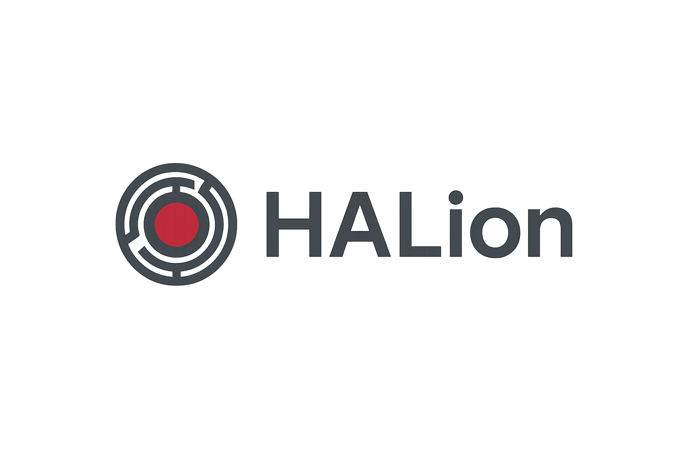

# HALion – Modular Intelligence Orchestrator

<p align='center'>  
 
</p>

<p align="center">
  <a href="https://www.python.org/downloads/"></a>
  <a href="https://streamlit.io/"></a>
  <a href="https://openai.com/blog/openai-api/"></a>
</p>

**HALion** es una plataforma extensible que convierte modelos de lenguaje como GPT-4 en asistentes inteligentes con capacidades personalizadas mediante herramientas modulares (function calling).

> "No es un chatbot. Es una plataforma de acciones orquestadas por IA."

## 🌟 Características Principales

- 🧩 **Arquitectura modular**: añade herramientas en Python como si fueran plugins.
- 🔧 **Panel de administración completo**: visualiza, activa o desactiva herramientas.
- ⚙️ **Configuración Avanzada de Modelos**: Ajustes detallados por modelo: temperatura, tokens, post-procesamiento.
- 🤖 **Generación automática de tools**: crea nuevas herramientas describiendo lo que quieres que hagan.
- 🔍 **Integración con APIs**: conecta fácilmente servicios externos como clima, búsqueda web, emails, etc.
- 🔐 **Gestión de entorno**: edita las variables del `.env` directamente desde la interfaz.
- 📊 **Logs detallados**: traza todas las llamadas a herramientas, con exportación JSON/CSV.
- 💬 **Chat con herramientas**: usa GPT-4 o GPT-3.5 con tus tools personalizadas.
- 🔄 **Activación dinámica**: elige qué herramientas están disponibles para el modelo.
- ⚙️ **Control de post-procesado**: decide si la IA debe continuar el flujo o devolver el resultado directo.
- 📚 **Documentación Integrada**: Guías, ejemplos y especificaciones directamente dentro del proyecto.

## ✨ ¿Qué es HALion?

HALion es un "orquestador" de inteligencia modular. No sólo responde, actúa. Permite que un modelo LLM invoque funciones definidas por el usuario de forma modular, dinámica y extensible. Puedes pensar en HALion como el backend de un sistema operativo para IA conversacional.

## 🧠 Cómo funciona

1. El usuario escribe un prompt en el chat.
2. GPT detecta que necesita usar una herramienta (`function_call`).
3. HALion ejecuta esa tool, pasando los parámetros automáticamente.
4. La respuesta de la tool se devuelve al modelo (para que continúe el razonamiento) o directamente al usuario.

Todo eso lo puedes ver en tiempo real, modificar, y extender.

## 🛠️🧠 Generar herramientas con IA

Simplemente describe la herramienta que necesitas. Ejemplo:

> "Necesito una herramienta que calcule el IMC dado el peso en kg y la altura en metros"

HALion generará el código, lo validará, lo guardará en disco y lo activará automáticamente.

## 🛠️ Instalación

```bash
# Clona el proyecto
$ git clone https://github.com/RGiskard7/halion-ai-orchestrator.git
$ cd halion-ai-orchestrator

# Crea un entorno virtual
$ python -m venv venv
$ source venv/bin/activate  # En Windows: venv\Scripts\activate

# Instala las dependencias
$ pip install -r requirements.txt

# Configura tu API Key en el archivo .env
$ cp .env.example .env
# Edita el archivo y añade tu clave de OpenAI

# Añadir tu API key de OpenAI en .env
OPENAI_API_KEY=sk-...
```

## 🚀 Uso Rápido

```bash
python run.py
```

Abre tu navegador en [http://localhost:8501](http://localhost:8501).

## 🧭 Guía de Navegación

### 💬 Chat con Herramientas
- Escribe tu mensaje.
- Si es necesario, el asistente invocará automáticamente una herramienta.
- El resultado se integrará en la conversación o se mostrará directamente.

### ⚙️ Administración
- Crea herramientas nuevas desde cero o con ayuda de la IA.
- Activa/desactiva herramientas sin tocar código.
- Gestiona variables de entorno, configura parámetros de modelo.
- Visualiza y exporta logs de actividad.

### 🧠 Herramientas Generadas con IA
- Describe la funcionalidad deseada.
- HALion genera el código, valida la sintaxis y activa la herramienta automáticamente.
- Puedes editar el código antes de usarlo.

## 🧰 Estructura del Proyecto

```
halion-ai-orchestrator/
├── app/                      # Código principal de la aplicación
│   ├── components/           # Componentes de la interfaz Streamlit
│   ├── controllers/          # Lógica de controladores
│   ├── core/                 # Funcionalidades centrales
│   │   ├── dynamic_tool_registry.py  # Registro de herramientas dinámicas
│   │   ├── executor.py       # Orquestador de OpenAI
│   │   ├── logger.py         # Sistema de logs
│   │   └── tool_manager.py   # Gestión de herramientas
│   ├── debug_logs/           # Logs específicos de la aplicación
│   │   ├── file_creation_debug.log
│   │   └── tool_calls.log
│   ├── config/               # Configuraciones persistentes
│   │   └── .tool_status.json # Estado de activación de herramientas
│   ├── models/               # Modelos de datos
│   ├── tools/                # Herramientas disponibles
│   ├── utils/                # Utilidades generales
│   │   └── ai_generation.py  # Generación de herramientas con IA
│   ├── views/                # Vistas de la aplicación
│   │   ├── admin_view.py     # Panel de administración
│   │   ├── chat_view.py      # Interfaz de chat
│   │   └── tools_view.py     # Gestión de herramientas
│   └── main.py               # Punto de entrada de la aplicación
├── docs/                     # Documentación
│   ├── assets/               # Recursos visuales (imágenes, iconos)
│   └── images/               # Imágenes para documentación
├── .env                      # Variables de entorno (privado)
├── .env.example              # Plantilla de variables de entorno
├── requirements.txt          # Dependencias del proyecto
├── pyproject.toml            # Configuración del proyecto
├── run.py                    # Script de ejecución simplificado
├── main_context.md           # Arquitectura y contexto técnico
└── roadmap.md                # Plan de desarrollo
```

## 🎯 Casos de Uso

- **Agente Conversacional Empresarial**: Gestiona agendas, sistemas internos, y bases de datos.
- **Dashboards Inteligentes**: Interfaz conversacional para análisis de datos y reportes.
- **IA para Automatización**: Ejecuta flujos definidos por herramientas invocadas por IA.
- **Integración con Apps y APIs**: Llama APIs externas y procesa los resultados mediante tools personalizadas.
- **Desarrollo de Prototipos**: Diseña asistentes y flujos rápidamente sin backend complejo.

## 🔄 Mantenimiento y Mejora

```bash
git pull origin main
pip install -r requirements.txt
```

Consulta el [CHANGELOG.md](./CHANGELOG.md) para más detalles.

## 📚 Recursos Clave

- [📄 Arquitectura y contexto](./main_context.md)
- [🛠️ Guía de desarrollo de tools](./docs/development.md)
- [🧭 Roadmap](./roadmap.md)
- [🧬 Contribuciones](./CONTRIBUTING.md)

## 🤝 Cómo Contribuir

1. Haz fork del repositorio
2. Crea una rama para tu funcionalidad (`feature/nombre`)
3. Haz commit y push (`git commit -m 'Tu cambio'`)
4. Abre un Pull Request con tu mejora

## 📞 Contacto

Para sugerencias, errores o mejoras, abre un issue o contáctame directamente.

---

<p align="center">
  <small>Desarrollado por <b>RGiskard7</b> ⚡ impulsado por HALion – IA modular y orquestada.</small>
</p>

