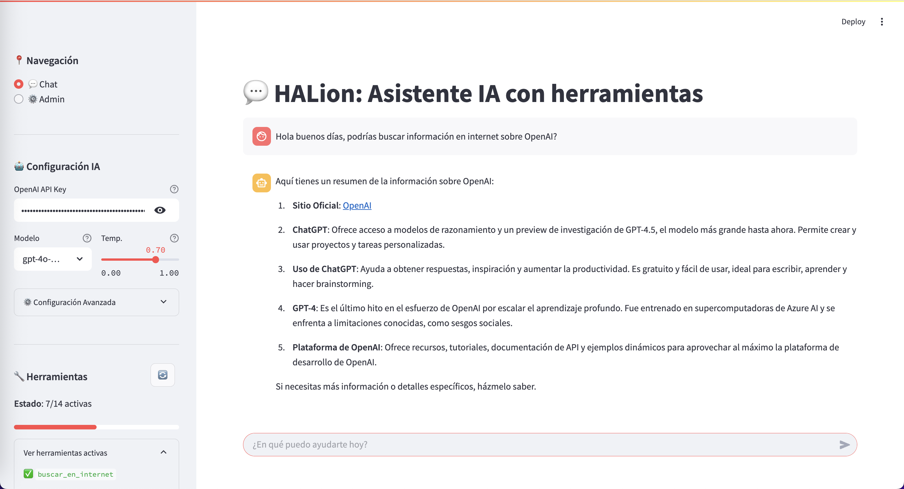
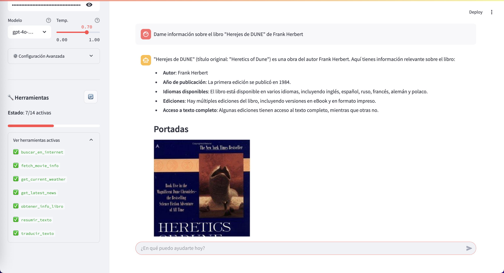
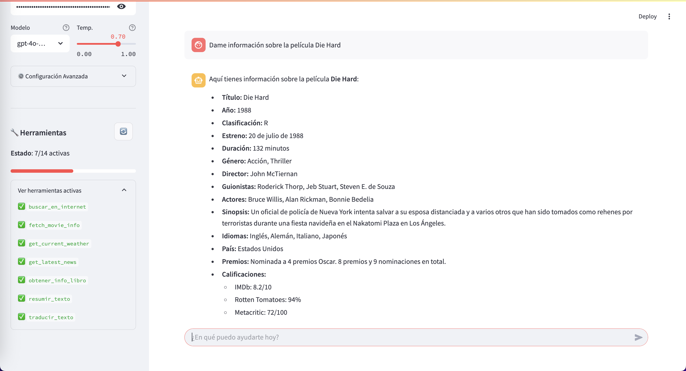
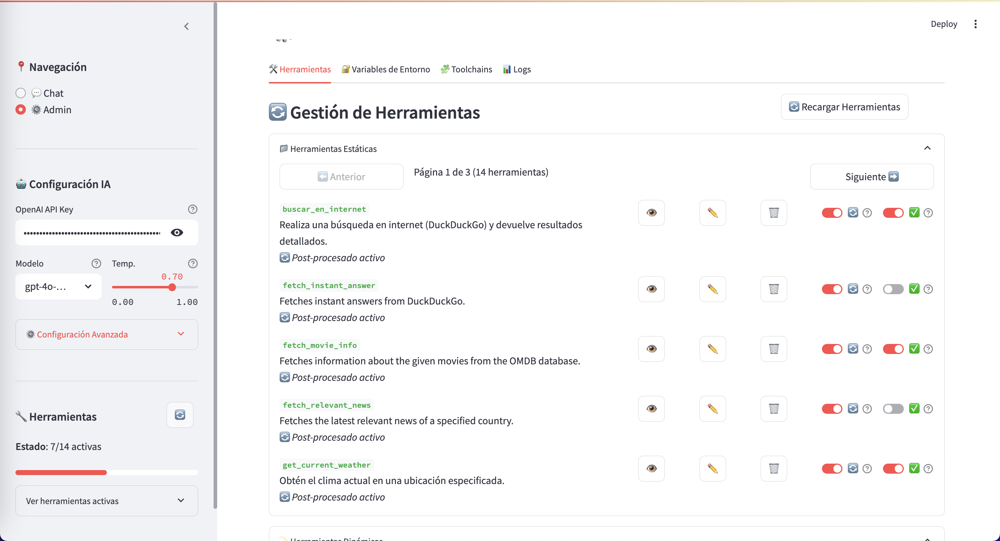
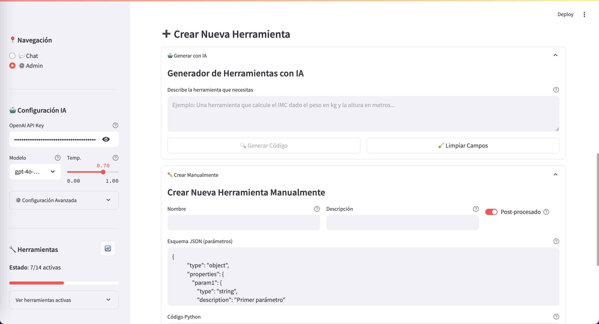
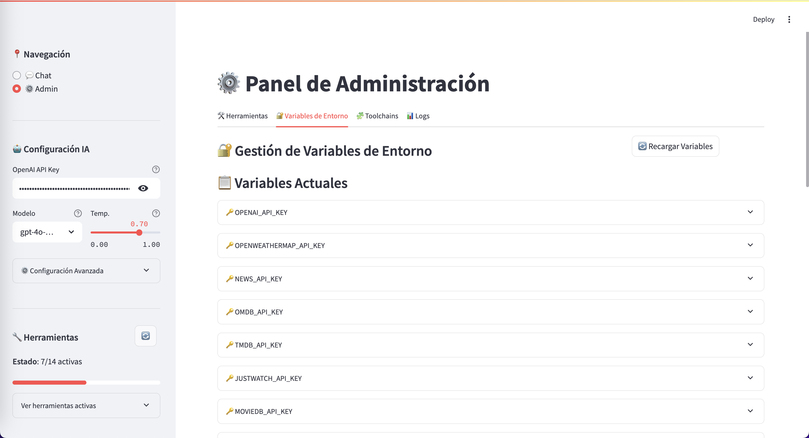
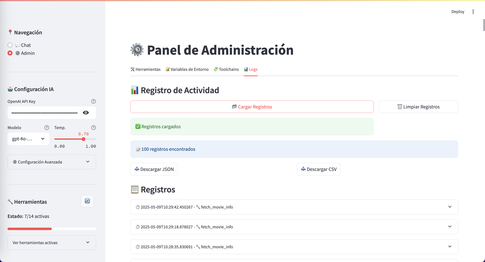

# HALion – Modular Intelligence Orchestrator

<p align='center'>  
 
</p>

<p align="center">
  <a href="https://www.python.org/downloads/"></a>
  <a href="https://streamlit.io/"></a>
  <a href="https://openai.com/blog/openai-api/"></a>
</p>

**HALion** es una plataforma extensible que convierte modelos de lenguaje como GPT-4 en asistentes inteligentes con capacidades personalizadas mediante herramientas modulares (function calling).

> "No es un chatbot. Es una plataforma de acciones orquestadas por IA."

<details>
<summary>📖 Índice de Contenidos</summary>

- [HALion – Modular Intelligence Orchestrator](#halion--modular-intelligence-orchestrator)
  - [🌟 Características Principales](#-características-principales)
  - [✨ ¿Qué es HALion?](#-qué-es-halion)
  - [🧠 Cómo funciona](#-cómo-funciona)
  - [🛠️🧠 Generar herramientas con IA](#️-generar-herramientas-con-ia)
  - [✨ HALion en Acción (Interfaz Gráfica)](#-halion-en-acción-interfaz-gráfica)
  - [🛠️ Instalación](#️-instalación)
  - [🚀 Uso Rápido](#-uso-rápido)
  - [🧭 Guía de Navegación](#-guía-de-navegación)
    - [💬 Chat con Herramientas](#-chat-con-herramientas)
    - [⚙️ Administración](#️-administración)
    - [🧠 Herramientas Generadas con IA](#-herramientas-generadas-con-ia)
  - [🧰 Estructura del Proyecto](#-estructura-del-proyecto)
  - [🎯 Casos de Uso](#-casos-de-uso)
  - [🔄 Mantenimiento y Mejora](#-mantenimiento-y-mejora)
  - [📚 Recursos Clave](#-recursos-clave)
  - [🤝 Cómo Contribuir](#-cómo-contribuir)
  - [📞 Contacto](#-contacto)
  - [📄 Licencia](#-licencia)

</details>

## 🌟 Características Principales

- 🧩 **Arquitectura modular**: añade herramientas en Python como si fueran plugins.
- 🔧 **Panel de administración completo**: visualiza, activa o desactiva herramientas.
- ⚙️ **Configuración Avanzada de Modelos**: Ajustes detallados por modelo: temperatura, tokens, post-procesamiento.
- 🤖 **Generación automática de tools**: crea nuevas herramientas describiendo lo que quieres que hagan.
- 🔍 **Integración con APIs**: conecta fácilmente servicios externos como clima, búsqueda web, emails, etc.
- 🔐 **Gestión de entorno**: edita las variables del `.env` directamente desde la interfaz.
- 📊 **Logs detallados**: traza todas las llamadas a herramientas, con exportación JSON/CSV.
- 💬 **Chat con herramientas**: usa GPT-4 o GPT-3.5 con tus tools personalizadas.
- 🔄 **Activación dinámica**: elige qué herramientas están disponibles para el modelo.
- ⚙️ **Control de post-procesado**: decide si la IA debe continuar el flujo o devolver el resultado directo.
- 📚 **Documentación Integrada**: Guías, ejemplos y especificaciones directamente dentro del proyecto.

## ✨ ¿Qué es HALion?

HALion es un "orquestador" de inteligencia modular. No sólo responde, actúa. Permite que un modelo LLM invoque funciones definidas por el usuario de forma modular, dinámica y extensible. Puedes pensar en HALion como el backend de un sistema operativo para IA conversacional.

## 🧠 Cómo funciona

1. El usuario escribe un prompt en el chat.
2. GPT detecta que necesita usar una herramienta (`function_call`).
3. HALion ejecuta esa tool, pasando los parámetros automáticamente.
4. La respuesta de la tool se devuelve al modelo (para que continúe el razonamiento) o directamente al usuario.

Todo eso lo puedes ver en tiempo real, modificar, y extender.

## 🛠️🧠 Generar herramientas con IA

Simplemente describe la herramienta que necesitas. Ejemplo:

> "Necesito una herramienta que calcule el IMC dado el peso en kg y la altura en metros"

HALion generará el código, lo validará, lo guardará en disco y lo activará automáticamente.

## ✨ HALion en Acción (Interfaz Gráfica)

A continuación, se muestran algunas capturas de pantalla de la aplicación HALion en funcionamiento y su interfaz gráfica:

<p align="center">
  
   
</p>
<p align="center">
  
  
</p>
<p align="center">
  
  
</p>
<p align="center">
  
</p>

## 🛠️ Instalación

```bash
# Clona el proyecto
$ git clone https://github.com/RGiskard7/halion-ai-orchestrator.git
$ cd halion-ai-orchestrator

# Crea un entorno virtual
$ python -m venv venv
$ source venv/bin/activate  # En Windows: venv\Scripts\activate

# Instala las dependencias
$ pip install -r requirements.txt

# Configura tu API Key en el archivo .env
$ cp .env.example .env
# Edita el archivo y añade tu clave de OpenAI

# Añadir tu API key de OpenAI en .env
OPENAI_API_KEY=sk-...
```

## 🚀 Uso Rápido

```bash
python run.py
```

Abre tu navegador en [http://localhost:8501](http://localhost:8501).

## 🧭 Guía de Navegación

### 💬 Chat con Herramientas
- Escribe tu mensaje.
- Si es necesario, el asistente invocará automáticamente una herramienta.
- El resultado se integrará en la conversación o se mostrará directamente.

### ⚙️ Administración
- Crea herramientas nuevas desde cero o con ayuda de la IA.
- Activa/desactiva herramientas sin tocar código.
- Gestiona variables de entorno, configura parámetros de modelo.
- Visualiza y exporta logs de actividad.

### 🧠 Herramientas Generadas con IA
- Describe la funcionalidad deseada.
- HALion genera el código, valida la sintaxis y activa la herramienta automáticamente.
- Puedes editar el código antes de usarlo.

## 🧰 Estructura del Proyecto

```
halion-ai-orchestrator/
├── app/                                # Código principal de la aplicación Streamlit
│   ├── components/                     # Componentes reutilizables de la interfaz (Streamlit)
│   │   ├── tool_card.py                #   Ejemplo: Tarjeta para mostrar información de una tool
│   │   └── __init__.py
│   ├── config/                         # Archivos de configuración generados por la aplicación
│   │   ├── .tool_status.json           #   Estado (activo/inactivo, postproceso) de las tools
│   │   └── toolchains.json             #   Definiciones de las toolchains guardadas
│   ├── controllers/                    # Controladores (MVC): median entre vistas y lógica de negocio/core
│   │   ├── tool_controller.py          #   Controlador para la gestión de tools
│   │   ├── toolchain_controller.py     #   Controlador para la gestión de toolchains
│   │   └── __init__.py
│   ├── core/                           # Lógica central y fundamental de la aplicación
│   │   ├── tool_definition_registry.py #   Registro y gestión de archivos .py de las tools
│   │   ├── tool_manager.py             #   Gestión del estado en memoria y ejecución de tools individuales
│   │   ├── toolchain_registry.py       #   Registro y gestión de la persistencia de las toolchains
│   │   ├── env_manager.py              #   Gestión de variables de entorno (.env)
│   │   ├── logger.py                   #   Sistema de logging para eventos de la aplicación
│   │   └── __init__.py
│   ├── models/                         # Modelos de datos Pydantic
│   │   ├── toolchain_model.py          #   Modelo para las toolchains
│   │   └── __init__.py
│   ├── services/                       # Servicios (MVC): encapsulan la lógica de negocio
│   │   ├── chat_service.py             #   Servicio para la interacción con el chat (llamadas a OpenAI, etc.)
│   │   ├── tool_service.py             #   Servicio para la lógica de negocio de las tools (generación AI, etc.)
│   │   ├── toolchain_service.py        #   Servicio para la lógica de negocio de las toolchains (ejecución, etc.)
│   │   └── __init__.py
│   ├── tools/                          # Directorio donde se almacenan los archivos .py de las tools dinámicas
│   │   ├── ejemplo_tool.py             #   (Contiene ejemplos de herramientas como buscar_en_internet.py, etc.)
│   │   └── __init__.py
│   ├── utils/                          # Utilidades compartidas y helpers
│   │   ├── ai_generation.py            #   Utilidades para la generación de código mediante IA
│   │   ├── env_detection.py            #   Utilidades para la detección de variables de entorno en código
│   │   └── __init__.py
│   ├── views/                          # Vistas (MVC): scripts de Streamlit que renderizan la UI
│   │   ├── admin_view.py               #   Vista para la administración general
│   │   ├── chat_view.py                #   Vista para la interfaz de chat
│   │   ├── env_view.py                 #   Vista para la gestión de variables de entorno
│   │   ├── logs_view.py                #   Vista para visualizar los logs
│   │   ├── toolchains_view.py          #   Vista para la gestión de toolchains
│   │   ├── tools_view.py               #   Vista para la gestión de tools
│   │   └── __init__.py
│   ├── main.py                         # Punto de entrada principal de la aplicación Streamlit, gestiona la navegación
│   └── __init__.py                     # Hace que 'app' sea un paquete Python
├── docs/                               # Documentación del proyecto
│   ├── assets/                         # Recursos visuales para la documentación (ej: banners)
│   └── images/                         # Capturas de pantalla y otros diagramas
├── tests/                              # Pruebas unitarias y de integración
├── .env                                # Variables de entorno locales (privado, gitignored)
├── .env.example                        # Plantilla para el archivo .env
├── .gitignore                          # Especifica archivos y directorios ignorados por Git
├── ARCHITECTURE.md                     # Descripción detallada de la arquitectura del sistema
├── CHANGELOG.md                        # Registro de cambios del proyecto
├── LICENSE.md                          # Información de licencia del proyecto
├── README.md                           # Este archivo: información general del proyecto
├── requirements.txt                    # Dependencias de Python del proyecto
├── pyproject.toml                      # Archivo de configuración del proyecto (ej: para Poetry o Hatch)
├── run.py                              # Script de conveniencia para ejecutar la aplicación
├── main_context.md                     # Contexto general del proyecto (duplicado/similar a README o ARCHITECTURE)
└── roadmap.md                          # Plan de desarrollo futuro y funcionalidades pendientes
```

## 🎯 Casos de Uso

- **Agente Conversacional Empresarial**: Gestiona agendas, sistemas internos, y bases de datos.
- **Dashboards Inteligentes**: Interfaz conversacional para análisis de datos y reportes.
- **IA para Automatización**: Ejecuta flujos definidos por herramientas invocadas por IA.
- **Integración con Apps y APIs**: Llama APIs externas y procesa los resultados mediante tools personalizadas.
- **Desarrollo de Prototipos**: Diseña asistentes y flujos rápidamente sin backend complejo.

## 🔄 Mantenimiento y Mejora

```bash
git pull origin main
pip install -r requirements.txt
```

Consulta el [CHANGELOG.md](./CHANGELOG.md) para más detalles.

## 📚 Recursos Clave

- [📄 Arquitectura y contexto](./main_context.md)
- [🛠️ Guía de desarrollo de tools](./docs/development.md)
- [🧭 Roadmap](./roadmap.md)
- [🧬 Contribuciones](./CONTRIBUTING.md)

## 🤝 Cómo Contribuir

1. Haz fork del repositorio
2. Crea una rama para tu funcionalidad (`feature/nombre`)
3. Haz commit y push (`git commit -m 'Tu cambio'`)
4. Abre un Pull Request con tu mejora

## 📞 Contacto

Para sugerencias, errores o mejoras, abre un issue o contáctame directamente.

## 📄 Licencia

Este proyecto está licenciado bajo los términos de la licencia Apache 2.0. Consulta el archivo [LICENSE.md](./LICENSE.md) para más detalles sobre derechos, limitaciones y condiciones de uso.

---

<p align="center">
  <small>Desarrollado por <b>Edu Díaz</b> a.k.a <b>RGiskard7</b> ⚡ impulsado por HALion – IA modular y orquestada.</small>
</p>

